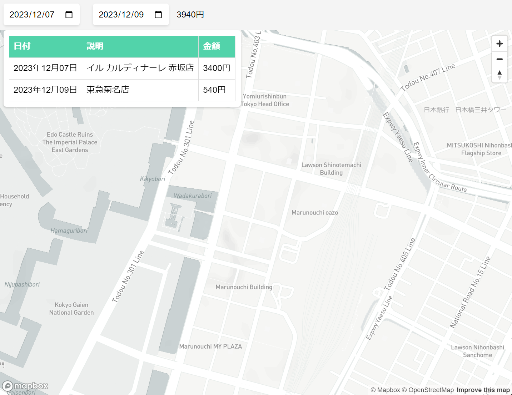

# Household Account

### About Me
This code is the digital household account book that can be easily used.
You can connect official line, Google spreadsheet and website by flask, python.
Please add it to Google Apps Script and flask server.

Today, there is a trend toward spending money in local areas, amid talk of "local production for local consumption. In Japan, the Furusato tax is an example of this trend, and measures are being taken to encourage people in urban centers to spend their money on local products. However, it is unclear how much money people currently spend in rural areas. We do not even know "where" the money is being spent.
Therefore, we will take a flexible approach to the household budget so that we can analyze how we spend our money based on "spatiality". We will be able to see what we bought, in which areas, and how much we spent, years or decades later.
With IoT tools.

### Specification
This is an example of official line communication.

This is the movie. This shows website of the map that shows where we spend money.

